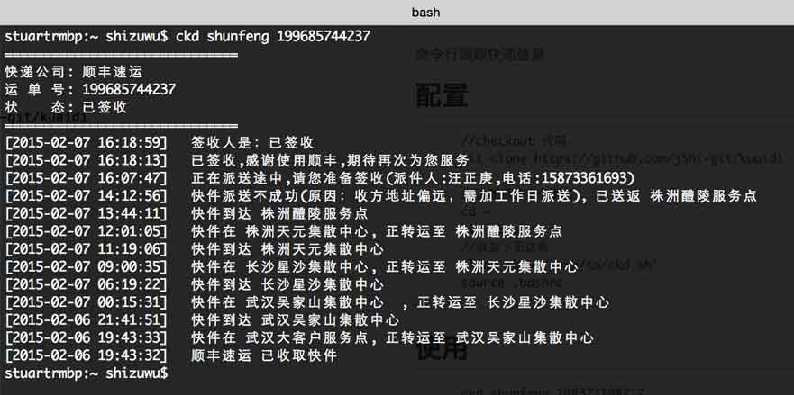

# kuaidi
命令行跟踪快递信息

##配置
```
	//checkout 代码
	git clone https://github.com/jShi-git/kuaidi
	
	//设置系统命令别名
	cd ~
	vim .bashrc
	//添加下面这条
	alias ckd='/path/to/ckd.sh'
	source .bashrc	
```

##使用
```
	ckd shunfeng 198377198217
```

##效果
